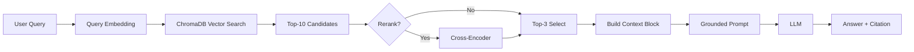

# Architecture — RAG Pipeline (Day 08 Lab)

> Template: Điền vào các mục này khi hoàn thành từng sprint.
> Deliverable của Documentation Owner.

## 1. Tổng quan kiến trúc

```
[Raw Docs]
    ↓
[index.py: Preprocess → Chunk → Embed → Store]
    ↓
[ChromaDB Vector Store]
    ↓
[rag_answer.py: Query → Retrieve → Rerank → Generate]
    ↓
[Grounded Answer + Citation]
```

**Mô tả ngắn gọn:**
Nhóm xây dựng RAG pipeline cho internal helpdesk — cho phép nhân viên hỏi về chính sách công ty (HR, IT, Refund, SLA) và nhận câu trả lời có trích dẫn nguồn. Pipeline giải quyết vấn đề LLM hallucinate khi trả lời câu hỏi về policy nội bộ bằng cách ép model chỉ trả lời từ retrieved context.

---

## 2. Indexing Pipeline (Sprint 1)

### Tài liệu được index
| File | Nguồn | Department | Số chunk |
|------|-------|-----------|---------|
| `policy_refund_v4.txt` | policy/refund-v4.pdf | CS | 6 |
| `sla_p1_2026.txt` | support/sla-p1-2026.pdf | IT | 7 |
| `access_control_sop.txt` | it/access-control-sop.md | IT Security | 8 |
| `it_helpdesk_faq.txt` | support/helpdesk-faq.md | IT | 5 |
| `hr_leave_policy.txt` | hr/leave-policy-2026.pdf | HR | 5 |

### Quyết định chunking
| Tham số | Giá trị | Lý do |
|---------|---------|-------|
| Chunk size | 400 tokens (~1600 ký tự) | Đủ để chứa 1 điều khoản hoàn chỉnh, không quá dài gây lost-in-the-middle |
| Overlap | 80 tokens (~320 ký tự) | Tránh cắt đứt điều kiện nằm ở ranh giới 2 chunk |
| Chunking strategy | Heading-based → paragraph-based | Ưu tiên cắt tại `=== Section ===`, nếu section quá dài thì cắt theo paragraph `\n\n` |
| Metadata fields | source, section, effective_date, department, access | Phục vụ filter, freshness, citation |

### Embedding model
- **Model**: paraphrase-multilingual-MiniLM-L12-v2 (sentence-transformers, local)
- **Vector store**: ChromaDB (PersistentClient)
- **Similarity metric**: Cosine

---

## 3. Retrieval Pipeline (Sprint 2 + 3)

### Baseline (Sprint 2)
| Tham số | Giá trị |
|---------|---------|
| Strategy | Dense (embedding similarity) |
| Top-k search | 10 |
| Top-k select | 3 |
| Rerank | Không |

### Variant (Sprint 3)
| Tham số | Giá trị | Thay đổi so với baseline |
|---------|---------|------------------------|
| Strategy | Dense (embedding similarity) | Không đổi |
| Top-k search | 10 | Không đổi |
| Top-k select | 3 | Không đổi |
| Rerank | cross-encoder/ms-marco-MiniLM-L-6-v2 | Thêm mới |
| Query transform | Không | Không đổi |

**Lý do chọn variant này:**
Baseline context recall đã đạt 5.00/5 — retrieval lấy đúng document. Vấn đề là ranking: dense search cho score gần nhau (0.72–0.78), chunk FAQ chung chung được rank cao hơn chunk chứa con số cụ thể (q01: SLA P1). Cross-encoder rerank nhìn cả cặp (query, chunk) nên phân biệt được "liên quan về chủ đề" vs "trả lời đúng câu hỏi". Chọn rerank thay vì hybrid vì chỉ muốn đổi một biến.

---

## 4. Generation (Sprint 2)

### Grounded Prompt Template
```
Answer only from the retrieved context below.
If the context is insufficient, say you do not know.
Cite the source field when possible.
Keep your answer short, clear, and factual.

Question: {query}

Context:
[1] {source} | {section} | score={score}
{chunk_text}

[2] ...

Answer:
```

### LLM Configuration
| Tham số | Giá trị |
|---------|---------|
| Model | gpt-4o-mini |
| Temperature | 0 (để output ổn định cho eval) |
| Max tokens | 512 |

---

## 5. Failure Mode Checklist

> Dùng khi debug — kiểm tra lần lượt: index → retrieval → generation

| Failure Mode | Triệu chứng | Cách kiểm tra |
|-------------|-------------|---------------|
| Index lỗi | Retrieve về docs cũ / sai version | `inspect_metadata_coverage()` trong index.py |
| Chunking tệ | Chunk cắt giữa điều khoản | `list_chunks()` và đọc text preview |
| Retrieval lỗi | Không tìm được expected source | `score_context_recall()` trong eval.py |
| Generation lỗi | Answer không grounded / bịa | `score_faithfulness()` trong eval.py |
| Token overload | Context quá dài → lost in the middle | Kiểm tra độ dài context_block |

---

## 6. Diagram (tùy chọn)

> TODO: Vẽ sơ đồ pipeline nếu có thời gian. Có thể dùng Mermaid hoặc drawio.


